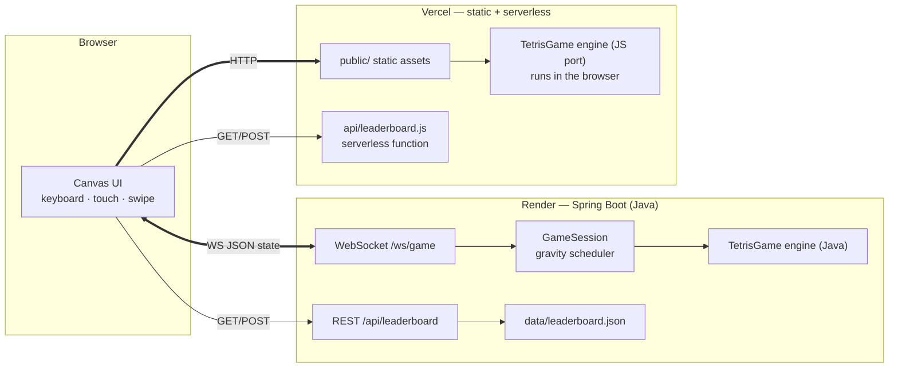
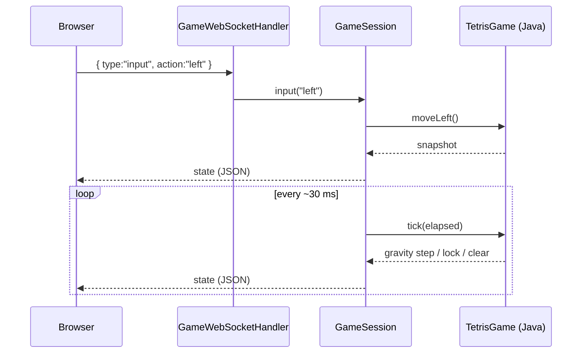
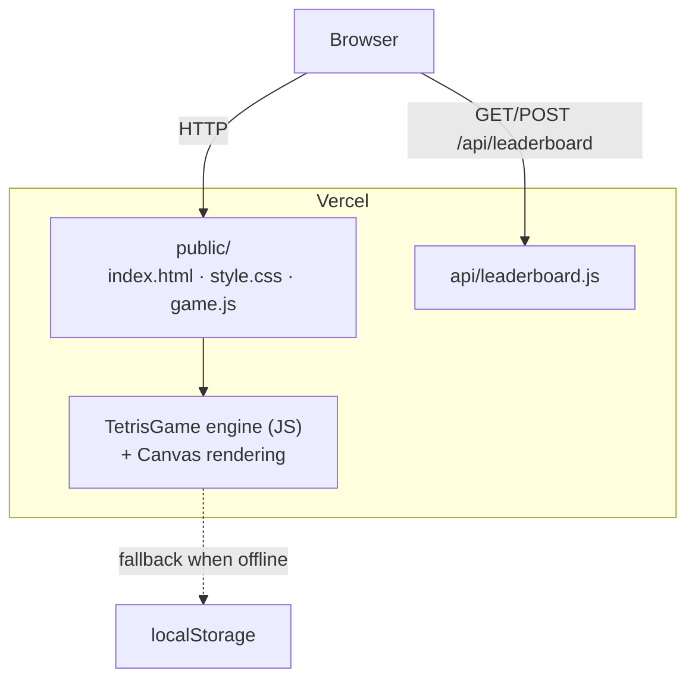
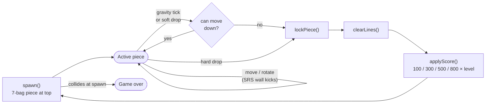
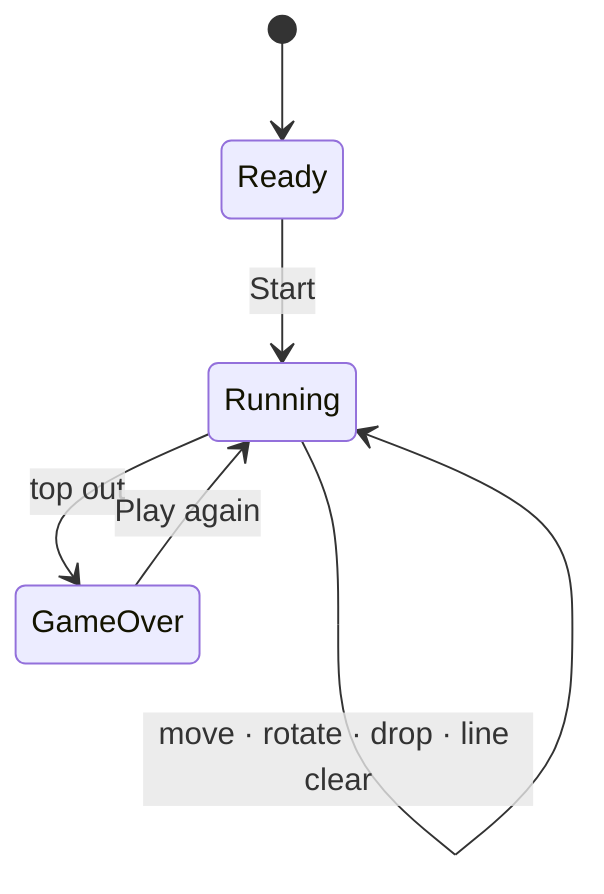
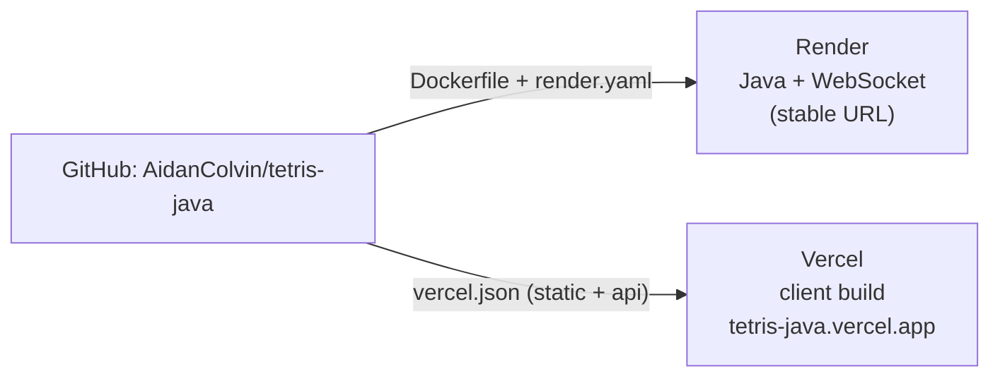

# Tetris

A full game of Tetris whose **rules engine is written in Java** — board, SRS
rotation with wall kicks, 7‑bag randomizer, line clears, guideline scoring,
gravity, hold and hard drop.

It ships in **two forms** from one repo:

- **Render** — the authoritative Java engine runs server‑side; the browser is a
  thin client over a WebSocket.
- **Vercel** — the same rules ported to browser JavaScript so the game runs
  client‑side and hosts statically.

**▶ Live (Vercel build):** https://tetris-java.vercel.app

---

## The two builds at a glance



| | Render build | Vercel build |
| --- | --- | --- |
| Where the game runs | **Server** (Java, authoritative) | **Browser** (JS port) |
| Transport | WebSocket `/ws/game` | none — local |
| Leaderboard | Spring REST → JSON file | serverless fn + `localStorage` |
| Source | `src/`, `Dockerfile`, `render.yaml` | `public/`, `api/`, `vercel.json` |
| Host needs | a JVM / Docker host | any static host |

---

## Render build — server‑authoritative Java

The server owns the game. Each connected browser gets its own `TetrisGame`, and
a scheduler advances gravity ~30 ms and broadcasts the state; the browser only
renders snapshots and forwards key/touch actions.



---

## Vercel build — client‑side JS

A faithful port of the Java engine (`public/game.js`) runs entirely in the
browser, so the playable game is just static files. The leaderboard is a small
serverless function, with `localStorage` as a per‑browser fallback.



---

## The engine (shared rules)

Both builds implement the same pipeline. In Java it lives in
`com.tetris.game.TetrisGame`; the JS port mirrors it method‑for‑method.



Game states:



---

## Repository layout

```
tetris-java/
├── src/main/java/com/tetris/
│   ├── TetrisApplication.java         Spring Boot entry point
│   ├── game/
│   │   ├── Tetromino.java             7 pieces · SRS states · wall-kick tables
│   │   └── TetrisGame.java            authoritative engine (rules + scoring)
│   └── web/
│       ├── WebSocketConfig.java       registers /ws/game
│       ├── GameWebSocketHandler.java  routes messages → sessions
│       ├── GameSession.java           per-player game + gravity loop
│       ├── Leaderboard.java           file-persisted top scores
│       ├── LeaderboardController.java REST /api/leaderboard
│       └── ScoreEntry.java
├── src/main/resources/
│   ├── static/                        Render frontend (served by Spring Boot)
│   └── application.properties         reads ${PORT:8080}
├── src/test/java/com/tetris/game/
│   └── TetrisGameTest.java            line clears · scoring · rotation · game over
├── public/                            Vercel client build (HTML/CSS/JS engine)
├── api/leaderboard.js                 Vercel serverless leaderboard
├── vercel.json · .vercelignore        Vercel config
├── Dockerfile · render.yaml           Render config
└── pom.xml
```

---

## Run locally

**Java backend (full server-authoritative game):**

```bash
mvn spring-boot:run
# or: mvn clean package && java -jar target/tetris.jar
```
Open http://localhost:8080.

**Vercel client build (static):**

```bash
python3 -m http.server 4000 --directory public
```
Open http://localhost:4000 (the leaderboard falls back to `localStorage` without the serverless function).

---

## Controls

| Key | Action | | Touch |
| --- | --- | --- | --- |
| ← / → | Move | | on‑screen ◀ ▶ or swipe |
| ↓ | Soft drop | | ▼ button or swipe down |
| ↑ / X | Rotate CW | | ⟳ button or tap board |
| Z | Rotate CCW | | — |
| Space | Hard drop | | ⤓ button or flick down |
| C | Hold | | hold button |

The UI is responsive (iPhone / iPad / desktop), follows system light/dark, and
shows on‑screen controls on touch devices.

---

## Tests

```bash
mvn test
```
`TetrisGameTest` covers the core rules deterministically: single/double line
clears and row shifting, the 100/300/500/800 scoring table and level‑up, game
over on spawn collision, and rotation.

---

## Deploy



- **Render** — `Dockerfile` + `render.yaml` blueprint. Works as‑is on any
  JVM/Docker host (Render, Railway, Fly.io); the host injects `PORT`.
- **Vercel** — `vercel --prod` deploys `public/` as static plus `api/` as
  serverless functions.
